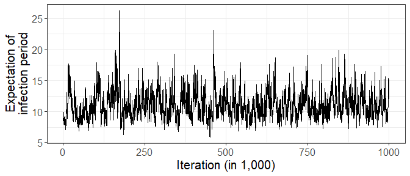

<!-- README.md is generated from README.Rmd. Please edit that file -->

# PDSIR

<!-- badges: start -->
<!-- badges: end -->

The `PDSIR` R package implements an efficient data augmentation MCMC
(DA-MCMC) algorithm for exact Bayesian inference under the semi-Markov
stochastic susceptible-infectious-removed (SIR) model, given discretely
observed counts of infections. The novelty of this DA-MCMC algorithm is
the *joint* update of the high-dimensional latent data. In a
Metropolis-Hastings step, the latent data are jointly proposed from a
surrogate process carefully designed to closely resemble the target
process and from which we can efficiently generate epidemics consistent
with the observed data. This yields a MCMC algorithm that explores the
high-dimensional latent space efficiently, mixes significantly better
than single-site samplers, and scales to outbreaks with thousands of
infections.

The package also contains data from the 2013-2015 outbreak of Ebola in
Western Africa.

## Installation

You can install the development version of PDSIR from
[GitHub](https://github.com/) with:

``` r
# install.packages("devtools")
devtools::install_github("rmorsomme/PDSIR")
```

## Illustration on synthetic data

We start by generating artificial data from a semi-Markov SIR process
with Weibull-distributed infection periods. We stop the process at time
`t_end=4`, when the outbreak is not completely over
=4").

``` r
library(PDSIR)

# Setup
set.seed(1)
S0 <- 150  # initial number of susceptible individuals
I0 <- 5    # initial number of infectious individuals

t_end <- 4 # end of observation period

iota_dist <- "weibull" # distribution of the infection periods
theta <- list(
  R0 = 2,               # basic reproduction number
  lambda = 1, shape = 2 # parameters of the Weibull distribution for the infection periods
  )


# Simulate artificial data
SIR <- simulate_SEM(S0, I0, t_end, theta, iota_dist)


# Trajectories of compartments
draw_trajectories(SIR, t_end)
```


The observed data consist the number of infections in pre-specified
intervals. here, we consider `K=10` intervals of equal length.

``` r
K <- 10 # number of observation intervals
Y <- observed_data(SIR, K)

print(Y$ts ) # endpoints of the intervals
#>  [1] 0.0 0.4 0.8 1.2 1.6 2.0 2.4 2.8 3.2 3.6 4.0
print(Y$I_k) # number of infections per interval
#>  [1]  6  9 20 28 23 18  9  5  0  1
```

We run the DA-MCMC algorithm for `N=50,000` iterations using the
(default) weakly informative prior
")
and
")
independently. The entire latent data are updated each iteration
(`rho=1`, by default). The sampler is fast and achieves a healthy
acceptance rate in the Metropolis-Hastings step for the latent data.

``` r
out <- run_DAMCMC(Y, N = 5e4, iota_dist = iota_dist, theta_0 = theta) 

print(out$run_time)    # run time in seconds
#> [1] 103.77
print(out$rate_accept) # acceptance rate in the Metropolis-Hastings step for the latent data
#> [1] 0.2345
```

The traceplot for

indicates that the chain mixes well. The true value is

(red dotted line).


## Illustration on the 2013-2015 outbreak of Ebola in Western Africa

We now turn to a case study of the \$2013\$-\$2015\$ outbreak of Ebola
Haemorrhagic Fever in Western Africa. We consider the prefecture
Gueckedou in Guinea, where a total of 410 infections were observed
between December 2013 and May 2015. The observed data consist of the
number of infections in each week, which are shown below.


``` r
# set up
rm(list=ls())
set.seed(1)

S0 <- 292e3 # https://en.wikipedia.org/wiki/Prefectures_of_Guinea
I0 <- 5
t_end <- max(ebola_gueckedou$ts)

ebola_gueckedou$S0 <- S0
ebola_gueckedou$I0 <- I0
ebola_gueckedou$t_end <- t_end

iota_dist <- "weibull"
theta_0 <- list(R0 = 1, lambda = 0.01, shape = 2)  

N    <- 1e6
thin <- 1e2

# run MCMC
out <- run_DAMCMC(
    ebola_gueckedou, N = N, rho = 0.1, iota_dist = iota_dist, thin = thin, theta_0 = theta_0
)


print(out$run_time) # seconds
#> [1] 5793.27
print(out$rate_accept)
#> [1] 0.308215
```




## Reproducing the results in the paper Exact Inference for Stochastic Epidemic Models via Uniformly Ergodic Block Sampling

The GitHub repository
[PDSIR-article](https://github.com/rmorsomme/PDSIR-article) contains the
`R` scripts for reproducing the analyses and figures present in the
paper Exact Inference for Stochastic Epidemic Models via Uniformly
Ergodic Block Sampling by R. Morsomme and J. Xu available on ArXiv.
