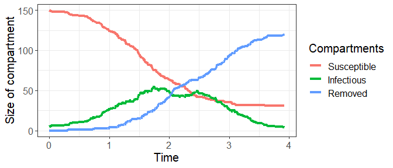
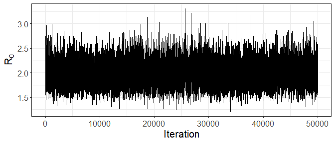
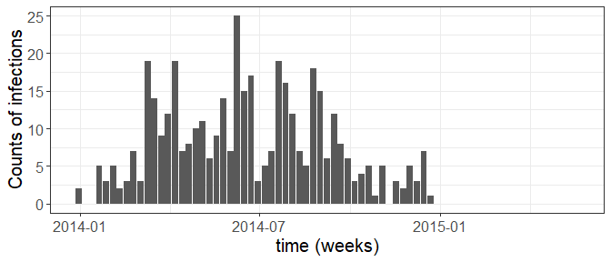
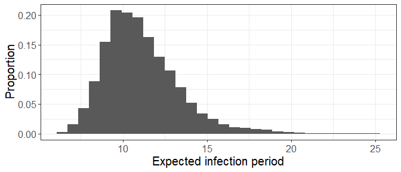
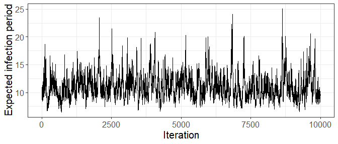

<!-- README.md is generated from README.Rmd. Please edit that file -->

# PDSIR

<!-- badges: start -->
<!-- badges: end -->

The `PDSIR` R package implements an efficient data augmentation MCMC
(DA-MCMC) algorithm for exact Bayesian inference under the semi-Markov
stochastic susceptible-infectious-removed (SIR) model, given discretely
observed counts of infections. The novelty of this DA-MCMC algorithm is
the *joint* update of the high-dimensional latent data. In a
Metropolis-Hastings step, the latent data are jointly proposed from a
surrogate process carefully designed to closely resemble the target
process and from which we can efficiently generate epidemics consistent
with the observed data. This yields a MCMC algorithm that explores the
high-dimensional latent space efficiently, mixes significantly better
than single-site samplers, and scales to outbreaks with thousands of
infections.

contains data for illustration

## Installation

You can install the development version of PDSIR from
[GitHub](https://github.com/) with:

``` r
# install.packages("devtools")
devtools::install_github("rmorsomme/PDSIR")
```

## Illustration on synthetic data

We employ the DA-MCMC on artifical data; semi-Marko model

This package contains the code used in the paper “Uniformly Ergodic
Data-Augmented MCMC for Fitting the General Stochastic Epidemic Model to
Incidence Data” by R. Morsomme and J. Xu available on ArXiv. We use it
to fit a semi-Markov susceptible-infectious-removed model to the
2013-2015 outbreak of Ebola Haemorrhagic Fever in Gu'eck'edou, Guinea.

This is a basic example which shows you how to solve a common problem:

``` r
library(PDSIR)

# Setup
set.seed(1)
S0 <- 150  # initial number of susceptible individuals
I0 <- 5    # initial number of infectious individuals

t_end <- 4 # # duration of observation period

iota_dist <- "weibull" # distribution of the infection periods
theta <- list(
  R0 = 2,               # basic reproduction number
  lambda = 1, shape = 2 # parameters of the Weibull distribution for the infection periods
  )  

theta <- complete_theta(theta, iota_dist, S0) # add the infection rate parameter, beta, used in the MCMC (and the average infection period, gamma)

# Simulate artificial data
SIR <- simulate_SEM(S0, I0, t_end, theta, iota_dist)

# Trajectories of compartments
draw_trajectories(SIR, t_end)
```



Observed data

``` r
K <- 10 # number of intervals
Y <- observed_data(SIR, K)

print(Y$ts ) # endpoints of intervals
#>  [1] 0.0 0.4 0.8 1.2 1.6 2.0 2.4 2.8 3.2 3.6 4.0
print(Y$I_k) # number of infections per interval
#>  [1]  6  9 20 28 23 18  9  5  0  1
```

Run DA-MCMC for `N=50,000` iterations with (default) prior. The entire
latent is updated each iteration.

``` r
out <- run_DAMCMC(Y, N = 5e4, iota_dist = iota_dist, theta_0 = theta)

print(out$run_time)    # run time in seconds
#> [1] 102.29
print(out$rate_accept) # acceptance rate in the Metropolis-Hastings step for the latent data
#> [1] 0.2345
```

Traceplot for `R_0`. The true value
is
(red dotted line on the figure).



## Illustration on the 2013-2015 outbreak of Ebola in Western Africa

a total of 410 infections in the prefecture Gueckedou, Guinea.



``` r

# set up
rm(list=ls())
set.seed(0)

S0 <- 292e3 # https://en.wikipedia.org/wiki/Prefectures_of_Guinea
I0 <- 5
t_end <- max(ebola_gueckedou$ts)

ebola_gueckedou$S0 <- S0
ebola_gueckedou$I0 <- I0
ebola_gueckedou$t_end <- t_end

iota_dist <- "weibull"
theta_0 <- list(R0 = 1, lambda = 0.01, shape = 2)  

theta_0 <- complete_theta(theta_0, iota_dist, S0)

N <- 1e6
thin <- 1e2

# run MCMC
out <- run_DAMCMC(
    ebola_gueckedou, N = N, rho = 0.1, iota_dist = iota_dist, thin = thin, theta_0 = theta_0
)


print(out$run_time)
#> [1] 2917.28
print(out$rate_accept)
#> [1] 0.311655
```





You’ll still need to render `README.Rmd` regularly, to keep `README.md`
up-to-date. `devtools::build_readme()` is handy for this. You could also
use GitHub Actions to re-render `README.Rmd` every time you push. An
example workflow can be found here:
<https://github.com/r-lib/actions/tree/v1/examples>.
